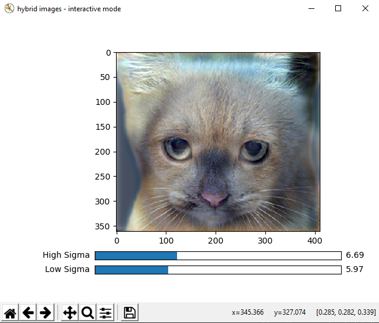

# Hybrid Images Generator

## What's This?
`convolution_fft.py` implements a function `convolve()` which convolves an images with a kernel using a FFT in order to speed up convolution for large kernels.

`hybrid.py` implements a function `make_gaussian_kernel()` which generates a gaussian kernel from a given variance, and `make_hybrid_image()` which takes two images as inputs and returns the sum of the images, where one image was high pass filtered and the other was low pass filtered.

The resulting images look like this:


## Interactive App
`app.py` provides an interactive window in which the user can control the variance of the gaussian kernel to control the cut-off frequency of the filters.



The image above is the result of combining


and


## How to Use It?
```
# Clone the repository.
git clone https://github.com/yannidd/hybrid-images

# Create local environment, activate it, and install the dependencies.
py -3.6 -m venv .env
.env/Scripts/Activate
pip install requirements

# Run the interactive app.
python app.py
```

## Where Can I Learn More About Hybrid Images?
Hybrid images were introduced in:

[Hybrid images](https://www.researchgate.net/profile/Philippe_Schyns/publication/220184425_Hybrid_images/links/0912f513edac5bd098000000.pdf). A Oliva, A Torralba, PG Schyns. 2006.

Extra information can be found [here](http://web.archive.org/web/20150321184824/http://cvcl.mit.edu/hybridimage.htm).